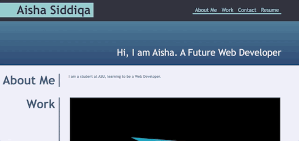

# Homework Challenge 2: Portfolio

## Technologies Used

HTML
CSS

## Description

A personal portfolio highlighting all of my major projects involving different technologies such as HTML and CSS.

## Usage

This portfolio can be used to view my past and current projects. The work section of the portfolio contains links to various projects where cutting edge technologies such as HTML and CSS are used to create wonderful websites. The header includes links which can be used to navigate to different sections of the portfolio. This website is designed for both desktop and smart devices usage.

## Code Snippet

Creating header and adding navigation links.

Creating the top banner and about me section.

## Gif Demo

Gif walkthrough of the application functioning.

## Author Info

* [Github] (https://github.com/ASgithub11)
* [LinkedIn] (https://www.linkedin.com/in/aisha-siddiqa-726578311/)

## Credits

N/A

## License

MIT License

Copyright (c) 2024 MIT

Permission is hereby granted, free of charge, to any person obtaining a copy of this software and associated documentation files (the "Software"), to deal in the Software without restriction, including without limitation the rights to use, copy, modify, merge, publish, distribute, sublicense, and/or sell copies of the Software, and to permit persons to whom the Software is furnished to do so, subject to the following conditions:

The above copyright notice and this permission notice shall be included in all copies or substantial portions of the Software.

THE SOFTWARE IS PROVIDED "AS IS", WITHOUT WARRANTY OF ANY KIND, EXPRESS OR IMPLIED, INCLUDING BUT NOT LIMITED TO THE WARRANTIES OF MERCHANTABILITY, FITNESS FOR A PARTICULAR PURPOSE AND NONINFRINGEMENT. IN NO EVENT SHALL THE AUTHORS OR COPYRIGHT HOLDERS BE LIABLE FOR ANY CLAIM, DAMAGES OR OTHER LIABILITY, WHETHER IN AN ACTION OF CONTRACT, TORT OR OTHERWISE, ARISING FROM, OUT OF OR IN CONNECTION WITH THE SOFTWARE OR THE USE OR OTHER DEALINGS IN THE SOFTWARE.

## Badges

N/A

## Features

N/A

## Contributing

N/A

## Tests

N/A

